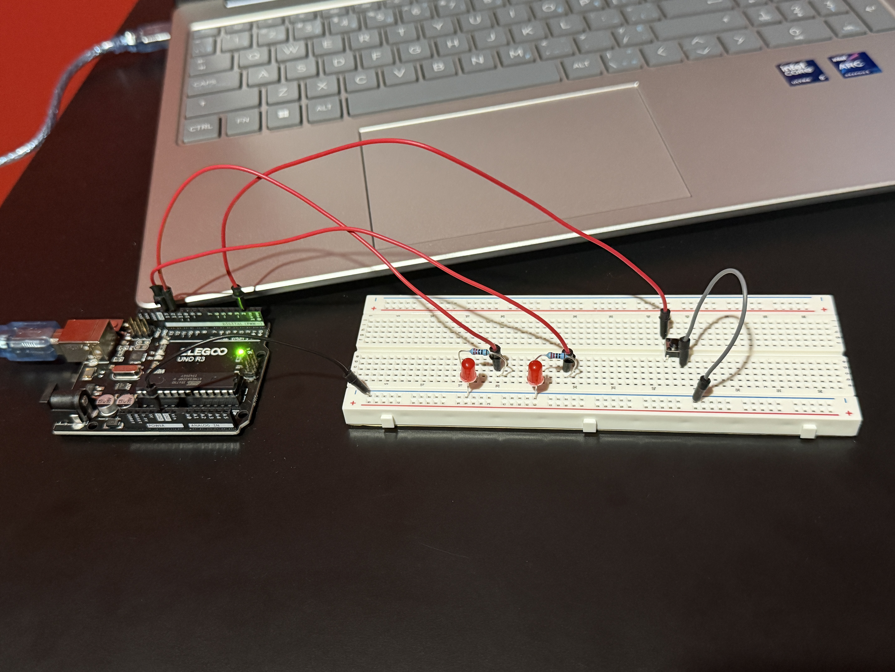
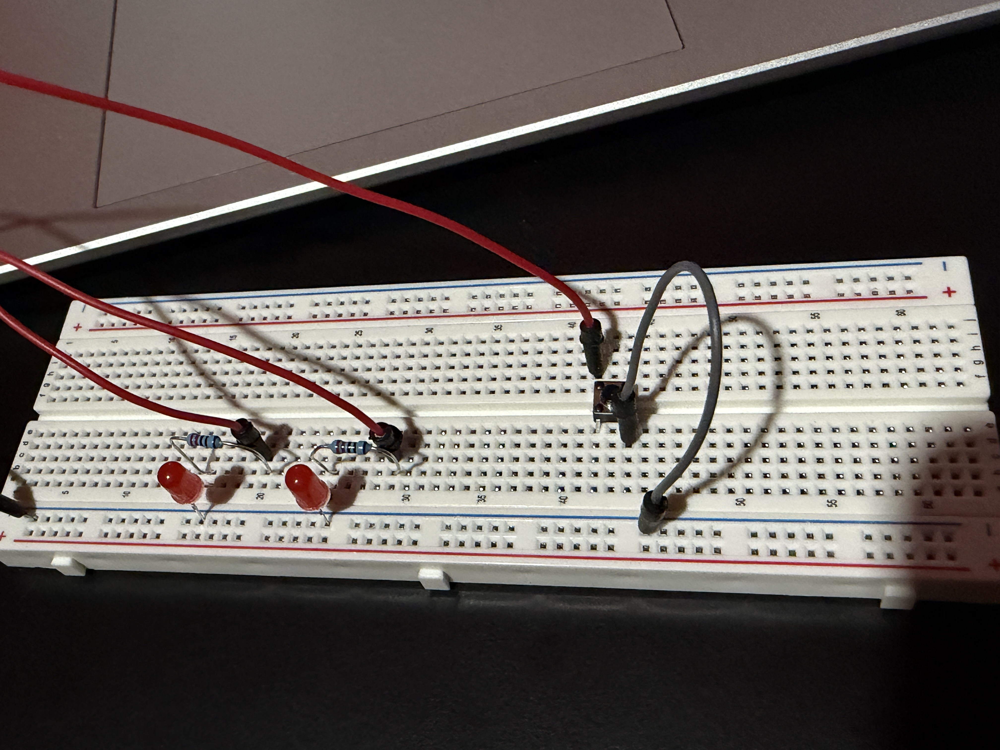

# Arduino Multi-Mode LED Controller

This project implements a button-controlled embedded state machine that cycles between four LED blinking modes.

Each mode drives two LEDs using different blinking patterns. Timing is implemented using non-blocking logic with `millis()` instead of `delay()`.

## Features
- Push button input using `INPUT_PULLUP`
- Software button debouncing
- Mode switching using a state machine
- Non-blocking timing with `millis()`
- Two LED outputs with multiple blink patterns

## Hardware
- Arduino Uno microcontroller
- Push button
- 2 red LEDs
- 2 × 220 Ω resistors

## How It Works
Each press of the push button increments the system mode. The program cycles through four modes that control the blinking behavior of the LEDs.

## Modes:
- Mode 0 – LEDs off
- Mode 1 – LED 1 blinks once every 1000ms, LED 2 is off
- Mode 2 – LED 2 blinks once every 300ms, LED 1 is off
- Mode 3 – Both LEDs alternate every 500ms.

## Wiring
**LED1**
Pin 13 → 220Ω resistor → LED anode → LED cathode → GND

**LED2**
Pin 12 → 220Ω resistor → LED anode → LED cathode → GND

**Button**
Pin 2 → button → GND (no resistor needed as the Arduino uses an internal pull-up resistor via INPUT_PULLUP)

## Circuit Setup (images)

## Concepts Demonstrated
- GPIO input and output
- Software debouncing
- Finite state machines
- Non-blocking embedded timing

## Notes
First project combining debouncing, state machines, and non-blocking timing together in one system.
